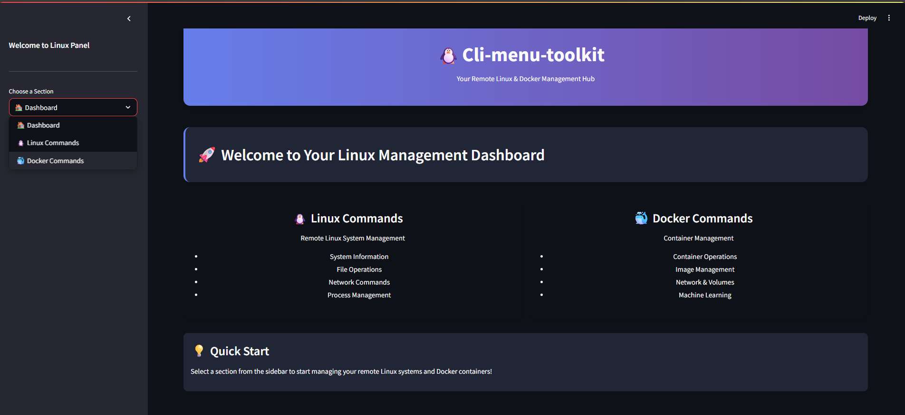

# cli-menu-toolkit

A professional web-based terminal panel for executing **Linux** and **Docker** commands remotely via SSH. Built with **Streamlit**, it enables system monitoring and container management with a user-friendly UI.

##  Features

- Remote Linux Command Execution via SSH
- Docker Container & Image Management
- Beautiful UI with dark mode styling
- Streamlit-based interactive menu
- Quick run for common DevOps commands

## 🖥️ Preview


## 📦 Installation

```bash
git clone https://github.com/yourusername/cli-menu-toolkit.git
cd cli-menu-toolkit
pip install -r requirements.txt
streamlit run cli_menu_toolkit.py
